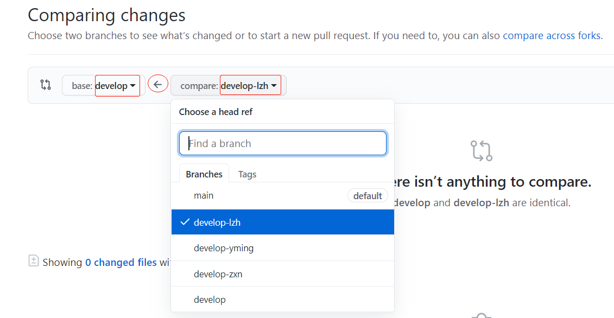

# Git协作向导

## 1. 安装

## 1.1 [Git](https://git-scm.com/downloads) 

详见 [Git下载、安装与环境配置](https://blog.csdn.net/huangqqdy/article/details/83032408)


## 1.2 UI工具: [TortoiseGit](https://tortoisegit.org/download/)

详见 [TortoiseGit安装与配置](https://cloud.tencent.com/developer/article/1024023)

推荐理由：可查看 <u>版本分支图|Revision Graph</u> 


注：仅支持windows, 其他UI工具: gitk (在git bash中输入gitk即可)、[GUI Clients](https://git-scm.com/downloads/guis/)。


## 2. Git概述

Git 是一个开源的<u>分布式</u>**版本控制**系统。


## 3. Git常用命令

详见 [Git 配置环境及常用命令整理](https://www.cnblogs.com/shuqingstudy/p/10494764.html) 或 [Git使用教程](https://blog.csdn.net/YJG7D314/article/details/104551896)。注：后者类似于手册或教科书。


## 4. Git协作

### 4.1 基本原理

### 4.1.1 upstream, origin, local

**origin**副本<u>fork</u>自 **upstream**，再将**origin**副本<u>clone</u>到电脑中为**local**副本。

以test项目( https://github.com/birdflyi/test.git )为例:

​     **github网站**

​        **upsteam**(上游的项目): birdflyi/test.git (https://github.com/birdflyi/test.git)

​        **origin**(fork后的项目): your/test.git (https://github.com/your/test.git) 

​        注：**origin**又可以被称为下游项目**downstream**

​     **电脑端**

​        **local**(克隆到本地的项目): your/test.git (/path/to/your/git)

```asciiarmor
┌─ GitHub WebSite ────────────────────────────────────────────┐
│ ┌─ remote ────────────────────────────────────────────────┐ │
│ | ┌─ upstream ──────────┐         ┌─ origin ────────────┐ │ |
│ | │  birdflyi/test.git  │──fork──>│    your/test.git    │ │ |
│ | └─────────────────────┘         └─────────────────────┘ │ |
│ |                                            |            │ |
│ └────────────────────────────────────────────┼────────────┘ │
└──────────────────────────────────────────────┼──────────────┘
                                             clone
┌─ Computer Client ────────────────────────────┼──────────────┐
|                                              v              |
|                                   ┌─ local:work-dir ─────┐  |
|                                   │    your/test.git     │  |
|                                   └──────────────────────┘  |
└─────────────────────────────────────────────────────────────┘
```
即初始化时数据流向为： **upstream**----fork----->**origin**----clone---->**local**
然而，本地在clone时只提供了origin的地址，upstream仍未设置，因此需要单独设置一下upstream：

```bash
git remote add upstream https://github.com/birdflyi/test.git
```

接下来需要拉代码、修改并提交、推代码。假定通过1-3节，origin与local之间的操作已经可以顺利完成，那么我们还需要与upstream通信：

协作必然要把自己的代码同步到upstream的，如何同步呢？

——使用PR(即[PullRequest](https://www.zhihu.com/question/21682976))即可。


### 4.1.2 fetch, pull, push

其中拉代码包含fetch和pull，区别详见 [git pull 和 git fetch的区别？](https://www.zhihu.com/question/38305012)

实际的local中包含若干存储区，其中我们能直接查看和修改的仅仅是工作区working directory，其他存储区被隐藏着。

**工作区working directory** 与 **本地仓库local repository** 之间存在 **暂存区staging** ；

**本地仓库local repository** 与 **远程仓库 remote repository** 之间存在 **远程副本remote copy** : 


<center>图片来自 <a href="https://www.zhihu.com/question/38305012">git pull 和 git fetch的区别？</a></center>

**注解**(可跳过)：

> **工作区(working directory)，**简言之就是你工作的区域。对于git而言，就是的本地工作目录。工作区的内容会包含提交到暂存区和版本库(当前提交点)的内容，同时也包含自己的修改内容。
>
> **暂存区(stage area, 又称为索引区index)，**是git中一个非常重要的概念。是我们把修改提交版本库前的一个过渡阶段。查看GIT自带帮助手册的时候，通常以index来表示暂存区。在工作目录下有一个.git的目录，里面有个index文件，存储着关于暂存区的内容。git add命令将工作区内容添加到暂存区。
>
> **本地仓库(local repository)，**版本控制系统的仓库，存在于本地。当执行git commit命令后，会将暂存区内容提交到仓库之中。在工作区下面有.git的目录，这个目录下的内容不属于工作区，里面便是仓库的数据信息，暂存区相关内容也在其中。
>
> **远程版本库(remote repository)，**与本地仓库概念基本一致，不同之处在于一个存在远程，可用于远程协作，一个却是存在于本地。通过push/pull可实现本地与远程的交互；
>
> **远程仓库副本，**可以理解为存在于本地的远程仓库缓存。如需更新，可通过git fetch/pull命令获取远程仓库内容。使用fech获取时，并未合并到本地仓库，此时可使用git merge实现远程仓库副本与本地仓库的合并。


**数据流图**如下所示：

```asciiarmor
┌─ GitHub WebSite ───────────────────────────────────────────────────────────────────────────────────────────────────┐
│  ┌─ remote ─────────────────────────────────────────────────────────────────────────────────────────────────────┐  │
│  |                                                ┌─ origin ────────────┐           ┌─ upstream ──────────┐     |  │
│  |                                                │    your/test.git    │=====PR===>│  birdflyi/test.git  │     |  |
│  |                                                └─────────────────────┘           └─────────────────────┘     |  │
│  |                                                         |   |   ^                            |               |  │
│  └─────────────────────────────────────────────────────────┼───┼───┼────────────────────────────┼───────────────┘  │
└────────────────────────────────────────────────────────────┼───┼───┼────────────────────────────┼──────────────────┘
                                               fetch [origin]|   |   |push origin            fetch|upstream
                                                    pull [origin]|   |                            |
┌─ Computer Client ──────────────────────────────────────────┼───┼───┼────────────────────────────┼──────────────────┐
|  ┌─ local ─────────────────────────────────────────────────┼───┼───┼────────────────────────────┼───────────────┐  |
|                                                            v   |   |                            v               |  |
|  |                                   ┌─ remote copy:origin ─┐  |   |                 ┌─ remote copy:upstream ─┐ |  |
|  |                                   |                      |  |   |                 |                        | |  |
|  |                                   |         your/        |<-┼---|                 |          your/         | |  |
|  |                                   |       test.git       |<-|   |<-push-condition-|        test.git        | |  |
|  |                                   |                      |  |   |    behind by    |                        | |  |
|  |                                   └──────────────────────┘  |   |     1 commit    └────────────────────────┘ |  |
|  |                                                    merge|   |   |                                            |  |
|  |                                      reset --soft HEAD~1|   |   |                                            |  |
|  |      *                                                  v   v   |                                            |  |
|  | ┌─ wk-dir ─┐             ┌─ staging ─┐                  ┌─ loc-repo ─┐                                       |  |
|  | |  >>red>> |    add .    | >>green>> |    commit -m     |   [ahead]  |                                       |  |
|  | |   your/  |────────────>|   your/   |─────────────────>|    your/   |                                       |  |
|  | | test.git |<────────────|  test.git |<─────────────────|  test.git  |                                       |  |
|  | |[uptodate]| restore .   |  <<red<<  |     reset .      |  <<green<< |                                       |  |
|  | └──────────┘checkout -- .└───────────┘restore --staged .└────────────┘                                       |  |
|  |      |                         |                               |                                             |  |
|  |      |---------------------commit -a-------------------------->|                                             |  |
|  |      |<----------------reset --hard HEAD~1---------------------|                                             |  |
|  |      |                         |                               |                                             |  |
|  └──────────────────────────────────────────────────────────────────────────────────────────────────────────────┘  |
└────────────────────────────────────────────────────────────────────────────────────────────────────────────────────┘
```

其中PR操作发生在远端而非本地。remote copy:upstream是不能自动获得远端的协作结果（如其他人的PR结果）的，然而push的前提是remote copy:upstream要落后于loc-repo一个版本，因此要在push之前执行**fetch upstream**，有冲突时还需要先解决冲突才能推送。

*仅有**工作区wk-dir**的状态可以在本地直接查看和修改。

注意：git pull 有额外的将remote copy:upstream同步到remote copy:origin的作用，从而实现origin副本通过fast-forward与upstream保持同步。推荐养成在git fetch upstream后即git pull的好习惯。


## 4.2 常用命令解释

从upstream到本地的remote copy:upstream，完整形式为**git fetch upstream [<远程分支名>]**：

```bash
git fetch upstream
```


从origin到本地的remote copy:origin，并merge到loc-repo，相当于fetch+merge，通常省略orgin，完整形式为**git pull origin [<远程分支名>:<本地分支名>]**：

```bash
git pull
```


！从loc-repo可直接重置代码wk-dir，此命令慎用，从图中可以看出可以直接影响工作区，需要提前备份工作区的修改，完整形式为**git reset --hard HEAD** 或 **git reset --hard HEAD~0**，~n代表重置为当前版本之前的第n个版本，0表示重置为当前版本，放弃新添加的更改：

```bash
git reset --hard
```

从loc-repo可直接重置代码wk-dir，此命令不会丢失当前工作区修改，若不想备份，建议使用**git reset**命令，之后再解决冲突，完整形式为**git reset HEAD** 或 **git reset HEAD~0**。

```bash
git reset
```


将`<extra-branch>`合并到当前的分支`<base-branch>`中，需要提前使用`git checkout <base-branch>`切换好分支，运行完成后当前的分支是主分支：

```bash
git merge <extra-branch>
```

注：若当前的分支`<base-branch>`落后于`<extra-branch>`，使用此命令则会直接将当前的分支HEAD移动到`<extra-branch>`的HEAD位置，称为`fast-forward`模式，若不想立即移动到最新的位置，可以加`--no-ff`禁用fast-forward模式。


将当前的分支`<current-branch>`变基到`<base-branch>`末尾，需要提前使用`git checkout <base-branch>`切换好分支，运行完成后将是`<base-branch>`+`<current-branch>`的单向链表，当前分支的基改变，即删除最近一次分叉处的父节点，重新链接到`<base-branch>`的尾部，此方式能保障历史回溯性，除了合入主分支和release外，均推荐使用此方式合并分支：

```bash
git rebase <base-branch>
```

注：也可以使用`git rebase <base-branch> <post-branch>`或者`git rebase --onto <base-branch> <post-branch-start> <post-branch-end>`直接rebase，而不必配合当前分支， 注意这种方式的参数都是按结果的HEAD指向顺序放置的。详见[[Git] Git整理(四) git rebase 的使用](https://blog.csdn.net/FightFightFight/article/details/80850328)。


从本地的loc-repo推送到origin的远端分支`<remote-branch>`上，通常是loc-repo处于ahead状态，且需要比remote copy:origin及remote copy:upstream领先1个commit：

```bash
git push -f origin <remote-branch>
```

注：执行此语句之前一般需要执行`git fetch upstream`，并解决协作者与自己的冲突，协作者提交的结果仅能在remote copy:upstream中获取，故此语句常常是解决推送失败的关键。


## 4.3 分支管理策略

参考[分支管理策略](https://www.liaoxuefeng.com/wiki/896043488029600/900005860592480)：

> 在实际开发中，我们应该按照几个基本原则进行分支管理：
>
> 首先，`master`分支应该是非常稳定的，仅用来发布新版本；
>
> 开发都在`dev`分支上，也就是说，`dev`分支是不稳定的，到某个时候，比如1.0版本发布时，再把`dev`分支合并到`master`上，在`master`分支发布1.0版本；
>
> 每个人承担的任务不同，都应该有自己的分支`feature`，完成后向`dev`分支上合并。

如图：


对应到github默认的分支管理策略：

```asciiarmor
master  <--> main
dev     <--> develop
feature <--> feature
```


# 5. 贡献指南

参考[开源贡献指南](https://github.com/alibaba/Sentinel/wiki/%E5%BC%80%E6%BA%90%E8%B4%A1%E7%8C%AE%E6%8C%87%E5%8D%97)

# 5.1 行为准则

能换位思考

相互尊重，相互包容

拿来的东西要有出处哦，尊重劳动成果也是必要的

讲文明，懂礼貌

批评中肯，就事论事

好奇心很重要，同理心也很重要

保护自己的隐私，保护他人的隐私

或者：[行为准则](https://github.com/birdflyi/query_clickhouse/blob/main/CODE_OF_CONDUCT.md)


## 5.2 贡献

欢迎提issue、提PR(PullRequest)、增加功能、修改bug、更新文档、美化界面等。意见建议、相关信息、互助、文档和项目的改进并重。


## 5.3 Issue&PR

如果您是初次贡献，可以先从 [`good first issue`](https://github.com/birdflyi/query_clickhouse/issues?q=is%3Aissue+is%3Aopen+label%3A%22good+first+issue%22) 列表中认领一个比较小的任务来快速参与社区贡献。您可以直接在相应 issue 中回复参与意愿，然后参照下面的 GitHub 工作流指引解决 issue 并按照规范提交 PR，通过 review 后就会被 merge 到 main分支。

如果您想要贡献代码，您可以参考 **5.4 工作流程**，提交对应的 PR。如果您的 PR 包含非常大的变更，比如模块的重构或者添加新的组件，请**先提出相关 issue，发起详细讨论，达成一致后再进行变更**，并为其编写详细的文档来阐述其设计、解决的问题和用途。注意一个 PR 尽量不要过于大。如果的确需要有大的变更，可以将其按功能拆分成多个单独的 PR。


## 5.4 工作流程

1. 将[仓库](https://github.com/birdflyi/query_clickhouse) fork 到自己的 GitHub 下

   注：通常还生成ssh的key，后面提交文档的时候会用到。需要到生成的路径中找到key，复制文件内容，设置到git账户的setting中。详见 [Git 配置环境及常用命令整理](https://www.cnblogs.com/shuqingstudy/p/10494764.html) 。

2. 将 fork 后的仓库 clone 到本地，[设置你的upstream](https://wiki.jikexueyuan.com/project/github-basics/fork-synced.html)。

   ```bash
   git clone https://github.com/YOUR-USERNAME/query_clickhouse.git
   cd query_clickhouse
   git remote add upstream https://github.com/birdflyi/query_clickhouse.git
   ```

   可以通过`git remote -v`查看设置，应显示`origin`和`upstream`的fetch和push设置。

3. 保持origin及本地分支与upstream远程相应分支一致（通过 `fetch upstream` 和 `rebase` 操作）

   切换到develop分支

   ```bash
   git checkout develop
   ```

   保持origin及本地分支与upstream远程相应分支一致：

   ```bash
   git fetch upstream develop
   git pull
   git rebase upstream/develop
   ```

   注意：git pull 有额外的将upstream同步到origin的作用，从而实现origin副本通过fast-forward与upstream保持同步。推荐养成在git fetch upstream后即git pull的好习惯。

   如果rebase发生冲突，需要解决冲突：即输入`git fetch upstream`, `git pull`, `git rebase upstream/develop`之后，手动修改冲突文件，再用`git add .`和`git rebase --continue`完成此阶段。

   1.-3.已完成准备工作，当一个PR完成后，可以跳过1.-2.的步骤，从3.开始准备。

   4.-7.将完成提交和推送工作。

4. 在develop分支上再创建新的分支，在新的分支上进行开发操作（**请确保对应的变更都有测试用例或 demo 进行验证**）

   ```bash
   git checkout develop
   git checkout -b YOUR-NEW-BRANCH
   ```

5. 在本地修改代码或文件后，提交变更（**commit log要能体现主要做了什么**）

   ```bash
   git add .
   git commit -m "your commit message."
   ```

6. 保持origin及本地分支与upstream远程相应分支一致（通过 `fetch upstream` 和 `rebase` 操作）[与3.相同]

   ```bash
   git fetch upstream develop
   git pull
   git rebase upstream/develop
   ```

   注意：git pull 有额外的将upstream同步到origin的作用，从而实现origin副本通过fast-forward与upstream保持同步。推荐养成在git fetch upstream后即git pull的好习惯。

   如果rebase发生冲突，需要解决冲突：即输入`git fetch upstream`, `git pull`, `git rebase upstream/develop`之后，手动修改冲突文件，再用`git add .`和`git rebase --continue`完成此阶段。

7. 将提交 push 到 fork 的仓库下

   ```bash
   git push -f origin YOUR-NEW-BRANCH
   ```

   注：完整命令为：`git push -f origin YOUR-NEW-BRANCH:YOUR-NEW-BRANCH`

8. 创建一个 pull request (PR)

   在您的远程仓库网页中提PR。当push完成后，您的项目主页会自动显示出一个 Pull Request 的按钮。若有延迟，可点击分支旁的`New pull request`按钮。

   如图所示：(这里：YOUR-NEW-BRANCH指origin的develop-lzh分支，提交PR到upstream的develop分支)

   

   提交 PR 的时候请参考 [PR 模板](https://github.com/birdflyi/query_clickhouse/blob/main/.github/PULL_REQUEST_TEMPLATE/pull_request_template.md)。在进行较大的变更的时候请确保 PR 有一个对应的 Issue。

   等待reviewer的响应结果。

   若PR未被合入，则继续循环4.-7.即可，此步骤中的PR追踪的是upstream和origin的动态差异信息，只需要提交到origin新的修改即可，而不需要关闭未被合入状态的PR再重新开启新的PR。

9. PR被upstream合并后，维护origin

   删除开发分支YOUR-NEW-BRANCH，保持origin及本地分支与upstream远程相应分支一致（通过 `fetch upstream` 和 `rebase` 操作）[与3.相同]
   a.删除origin开发分支YOUR-NEW-BRANCH
   
   ```bash
   git push origin --delete YOUR-NEW-BRANCH
   ```
   b.删除本地开发分支YOUR-NEW-BRANCH
   ```bash
   git checkout develop -f
   git branch -D YOUR-NEW-BRANCH
   ```
   c.保持origin及本地分支与upstream远程相应分支一致（通过 `fetch upstream` 和 `rebase` 操作）[与3.相同]
   ```bash
   git fetch upstream develop
   git pull --ff upstream develop
   git rebase upstream/develop
   ```
   
   注意：git pull 有额外的将upstream同步到origin的作用，从而实现origin副本通过fast-forward与upstream保持同步。推荐养成在git fetch upstream后即git pull的好习惯。
   
   如果rebase发生冲突，需要解决冲突：即输入`git fetch upstream`, `git pull`, `git rebase upstream/develop`之后，手动修改冲突文件，再用`git add .`和`git rebase --continue`完成此阶段。
   
   下一次PR可以从3.开始准备。

## 5.5 报告安全问题

若您发现任何的安全漏洞（或潜在的安全问题），请第一时间通过 [cs_zhlou@163.com](mailto:cs_zhlou@163.com) 邮箱私下联系我们。


## 5.6 Code review

所有的代码都需要经过 committer 进行 review。以下是我们推荐的一些原则：

- 可读性：代码遵循我们的开发规约，重要代码需要有详细注释和文档
- 优雅性：代码简练、复用度高，有着完善的设计


## 5.7 联系我们

如果您有任何问题与建议，请通过邮箱 [cs_zhlou@163.com](mailto:cs_zhlou@163.com)联系我们。
