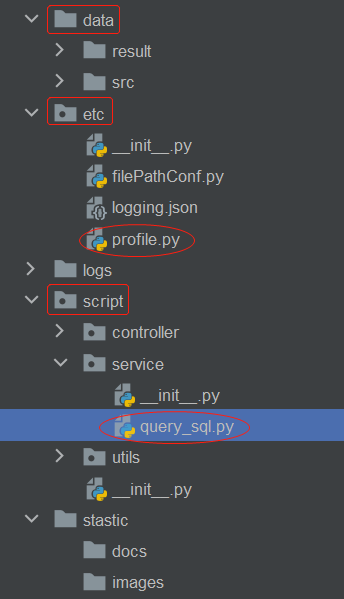
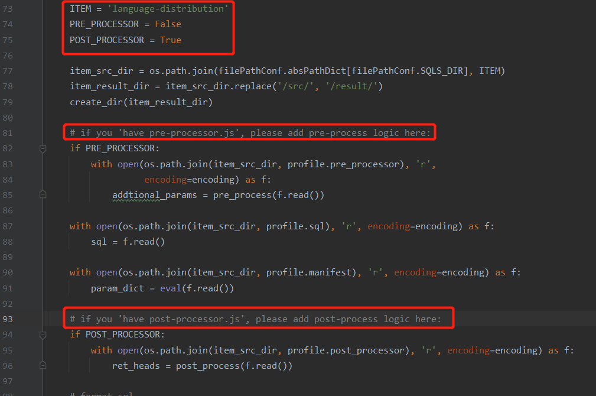

<a href="./stastic/docs/zh-cn/README.md">zh-cn</a> | <a href="./README.md">en-us</a>

# query_clickhouse
Connect to clickhouse, and from which query data with sqls.

***

## Project Directory

Here are three most important directories:

1. etc/: All of configurations and default settings are here. 

   Notes: 'profile.py' is very important for your privacy(be careful when pushing codes), for it includes many authentication settings. 'logging.json' is just for logging runtime informations.

2. data/: src ----script process----> result. Notes: 'src/' and 'result/' are corresponding with each other.

3. script/: typical javaweb directories(controller <------service<------utils).

## Quick Start

1. Set your authentication settings in 'profile.py'.

2. Modify '/script/query_sql.py':

   2.1 Clone your target project within [X-lab2017](https://github.com/X-lab2017)/**[github-analysis-report](https://github.com/X-lab2017/github-analysis-report)**, which can be a sub directory of 'github-analysis-report/sql/' or a sub directory of 'github-analysis-report/case-study/sql/'. Drop the copies in 'data/src/'. 

   2.2 Modify the pre-process and post-processor logic if necessary.

3. Run 'script/service/query_sql.py'. Check results in the directory 'data/result'.